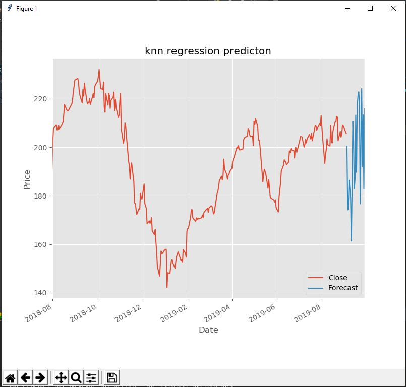

# Stock Prediction using linear regression and knn regression

> Homework for Siraj Raval ML Course - Unit 2

------------------

Inspired by https://www.youtube.com/watch?v=QLVMqwpOLPk&list=PLQVvvaa0QuDfKTOs3Keq_kaG2P55YRn5v&index=5

## Getting started in 10 minutes

- Clone this repo 
- Install requirements
- Run the script

:point_down:Screenshots:

  

  

------------------

